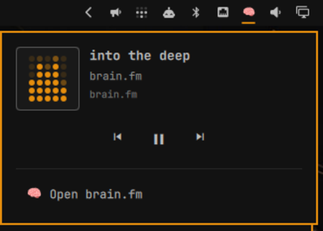

# omarchy-brainfm

**brain.fm in your Omarchy bar.** One icon, always there — click it for what's playing and real transport controls, without ever digging through browser tabs to find your focus session again.



## Why

You start a brain.fm session to focus. Twenty minutes later it's buried under six other windows and you have no idea if it's even still playing. This plugin puts a 🧠 in your bar that always knows — click it, see the track, hit pause, done. No alt-tabbing, no hunting for the tab.

## Features

- **One icon, always visible** — same footprint as your volume or network icon, not an extra always-on distraction in the bar
- **Real transport controls** — play, pause, skip, in a clean popup, not a browser tab you have to find first
- **One-click launch or focus** — click brain.fm not open? It opens. Already open? You're taken straight to it
- **A live level meter** instead of a broken album-art icon — animated, reacts to what's actually playing
- **Behaves exactly like every other bar popup** — click outside to dismiss it, same as your volume or Wi-Fi popup, nothing bespoke to learn
- **Zero setup beyond install** — no API keys, no config file, no login flow to configure

## Install

```
omarchy plugin add https://github.com/revans/omarchy-brainfm.git --enable
```

Or by hand:

```
git clone https://github.com/revans/omarchy-brainfm.git ~/.config/omarchy/plugins/rre.brainfm
omarchy plugin enable rre.brainfm
```

Already running Omarchy's built-in Media widget? You'll get two now-playing icons in the bar unless you turn one off:

```
omarchy plugin disable omarchy.media
```

## Update

```
omarchy plugin update rre.brainfm
```

Pulls the latest version, shows you what changed, and reloads the bar automatically — no reinstall, no manual file copying. Run `omarchy plugin update` with no id to update this and every other git-managed plugin you have installed at once.

## Requirements

- [Omarchy](https://omarchy.org/)
- A default browser that supports MPRIS media sessions (Chromium and Chromium-based browsers, which is what Omarchy ships by default)
- A brain.fm account — you log in once in your normal browser like you always do; this plugin doesn't touch your credentials or session
